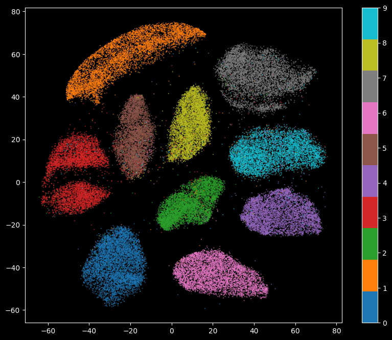

## How to install DMT-HI

To install the corresponding environment, you can follow the steps below.


#### Step 1: Create and Activate Conda Environment

```bash
conda create -n dmtlearn python=3.10  
conda activate dmtlearn

```

#### Step 2: Install PyTorch with CUDA Support
Install PyTorch, TorchVision, and TorchAudio with CUDA 12.3 support for GPU acceleration.

```bash
conda install pytorch torchvision torchaudio pytorch-cuda=12.3 -c pytorch -c nvidia
```

#### Step 3: Additional Dependencies
There are other dependencies specified in the install_env.sh script, you can install them using the following command. Make sure that `install_env.sh` is available in your directory.
```bash
pip install dmt_learn -U
```

## How to Use DMT-EV
DMT-EV (**Deep Manifold Transformation for Explainable Visualization**) is a deep-learning-based **dimension reduction** method designed to transform high-dimensional data into a lower-dimensional space while maintaining structure and providing explainability. Unlike traditional methods like **t-SNE** and **UMAP**, DMT-EV offers **parametric** learning, **data augmentation**, and **interpretable embeddings** through feature importance analysis.

### Step 1: Import Necessary Libraries
```python
import torch
import numpy as np
from dmt_learn import DMTLearn
import matplotlib.pyplot as plt
from torchvision import transforms
from torchvision.datasets import MNIST
```


### Step 2: Load and Preprocess Data
#### MNIST Dataset
The **MNIST dataset** is a collection of handwritten digits (0-9) used widely for image classification and machine learning benchmarks. It consists of:

* 60,000 training images and 10,000 test images.

* Each image is 28×28 pixels in grayscale.

* Labels correspond to digits from 0 to 9.

#### Visualize the images
We can use the following code to visualize the first 40 images:

```python
# load
torch.set_float32_matmul_precision('medium')
transform = transforms.Compose([
        transforms.ToTensor(),
    ])
# Load the MNIST dataset
train_data = MNIST(root='data', train=True, download=True, transform=transform)


# Display the first 40 images with a white background
fig, axes = plt.subplots(5, 8, figsize=(10, 6), facecolor='white')
for i, ax in enumerate(axes.flat):
    ax.imshow(train_data[i][0].numpy().squeeze(), cmap='gray_r')  # Use 'gray_r' to invert colors
    ax.set_title(f"Label: {train_data[i][1]}", color='black')  # Set title color to black for visibility
    ax.axis('off')
plt.tight_layout()
plt.show()
```


#### Convert Images to Flattened NumPy Arrays and Extract Labels

```python

# Convert images to NumPy arrays and flatten to 1D (28x28 -> 784)
DATA = np.stack([train_data[i][0].numpy().squeeze() for i in range(len(train_data))]).reshape((-1, 784))

# Extract corresponding labels
LABEL = np.array([train_data[i][1] for i in range(len(train_data))])

print(f"DATA.shape: {DATA.shape}")  # output: (60000, 784)
```

### Initialize and Train DMT-EV

```python
# Initialize the DMT-EV model
dmt = DMTLearn(
    random_state=0,  # Set a random seed for reproducibility
    max_epochs=4,     # Number of training epochs
)

# Fit the model and transform the dataset into a lower-dimensional space
vis_data = dmt.fit_transform(DATA)

print(f"vis_data.shape: {vis_data.shape}")  # output: (60000, 2)
```
The result is an array with 60000 samples, but only two feature columns (instead of the four we started with). This is because, by default, DMT-EV reduces down to 2D. 

```python

plt.figure(figsize=(10, 8))  
plt.scatter(vis_data[:, 0], vis_data[:, 1], marker='.', c=LABEL, cmap='tab10', s=0.5)
plt.colorbar()
plt.show()
```

