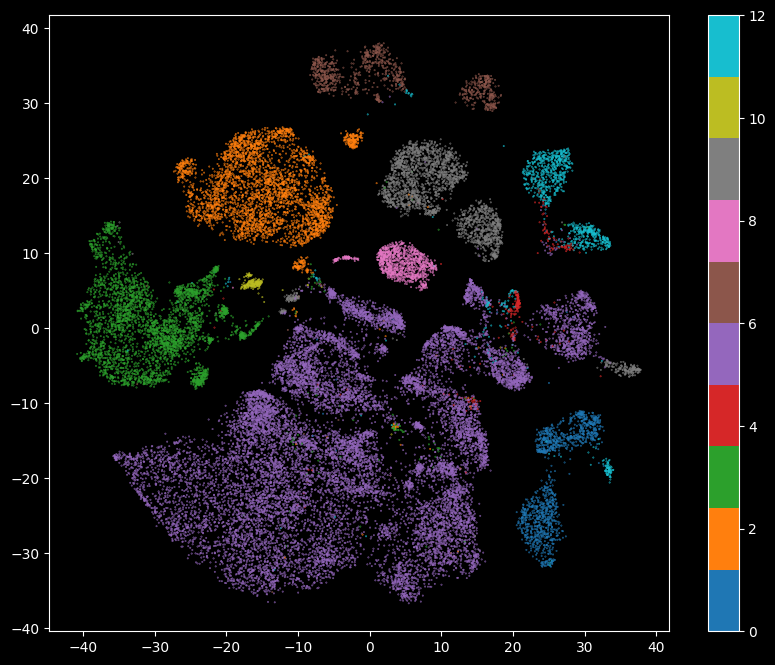

## Table of Contents

- [Table of Contents](#table-of-contents)
- [How to install DMT-EV on Linux](#how-to-install-dmt-ev-on-linux)
    - [Step 1: Create and Activate Conda Environment](#step-1-create-and-activate-conda-environment)
    - [Step 2: Install PyTorch with CUDA Support](#step-2-install-pytorch-with-cuda-support)
    - [Step 3: Additional Dependencies](#step-3-additional-dependencies)
- [How to install DMT-EV on Windows](#how-to-install-dmt-ev-on-windows)
    - [Step 1: Create and Activate Conda Environment](#step-1-create-and-activate-conda-environment-1)
    - [Step 2: Install PyTorch (CPU-Only Version)](#step-2-install-pytorch-cpu-only-version)
    - [Step 3: Additional Dependencies .](#step-3-additional-dependencies-)
- [How to Use DMT-EV](#how-to-use-dmt-ev)
  - [MNIST](#mnist)
    - [Step 1: Import Necessary Libraries](#step-1-import-necessary-libraries)
    - [Step 2: Load and Preprocess Data](#step-2-load-and-preprocess-data)
      - [MNIST Dataset](#mnist-dataset)
      - [Visualize the images](#visualize-the-images)
      - [Convert Images to Flattened NumPy Arrays and Extract Labels](#convert-images-to-flattened-numpy-arrays-and-extract-labels)
    - [Step 3: Initialize and Train DMT-EV](#step-3-initialize-and-train-dmt-ev)
    - [Comparison and analysis(MNIST)](#comparison-and-analysismnist)
      - [Step 1: Train t-SNE Model](#step-1-train-t-sne-model)
      - [Step 2: Train UMAP Model](#step-2-train-umap-model)
      - [Step 3: Visualization and Comparison](#step-3-visualization-and-comparison)
  - [EpitheliaCell\_data](#epitheliacell_data)
    - [Step 1: Data Infor](#step-1-data-infor)
    - [Step 2: Sampling](#step-2-sampling)
    - [Step 3: Initialize and Train DMT-EV(EpitheliaCell\_data)](#step-3-initialize-and-train-dmt-evepitheliacell_data)
    - [Comparison and analysis(EpitheliaCell\_data)](#comparison-and-analysisepitheliacell_data)
      - [Step 1: Train t-SNE Model](#step-1-train-t-sne-model-1)
      - [Step 2: Train UMAP Model](#step-2-train-umap-model-1)
      - [Step 3: Visualization and Comparison](#step-3-visualization-and-comparison-1)


## How to install DMT-EV on Linux

To install the corresponding environment, you can follow the steps below.


#### Step 1: Create and Activate Conda Environment

```bash
conda create -n dmtlearn python=3.10  
conda activate dmtlearn

```

#### Step 2: Install PyTorch with CUDA Support
Install PyTorch, TorchVision, and TorchAudio with CUDA 12.3 support for GPU acceleration.

```bash
conda install pytorch torchvision torchaudio pytorch-cuda=12.3 -c pytorch -c nvidia
```

#### Step 3: Additional Dependencies
There are other dependencies specified in the install_env.sh script, you can install them using the following command. Make sure that `install_env.sh` is available in your directory.
```bash
bash install_env.sh
```

## How to install DMT-EV on Windows

Follow these steps to create and configure a dedicated Conda environment for `dmtlearn` using CPU-only computation.


#### Step 1: Create and Activate Conda Environment
First, create a new Conda environment named dmtlearn with Python 3.10:
```
conda create -n dmtlearn python=3.10  
conda activate dmtlearn

```


#### Step 2: Install PyTorch (CPU-Only Version)
Since CUDA is not supported, install the CPU-only version of PyTorch, TorchVision, and TorchAudio:

```bash
conda install pytorch torchvision torchaudio cpuonly -c pytorch

```

#### Step 3: Additional Dependencies .
There are other dependencies specified in the `requirment.txt` script, you can install them using the following command. Make sure that `requirment.txt` is available in your directory.
```bash
pip install -r requirements.txt
```

## How to Use DMT-EV
DMT-EV (**Deep Manifold Transformation for Explainable Visualization**) is a deep-learning-based **dimension reduction** method designed to transform high-dimensional data into a lower-dimensional space while maintaining structure and providing explainability. Unlike traditional methods like **t-SNE** and **UMAP**, DMT-EV offers **parametric** learning, **data augmentation**, and **interpretable embeddings** through feature importance analysis.


### MNIST

#### Step 1: Import Necessary Libraries
```python
import torch
import numpy as np
from dmt_learn import DMTLearn
import matplotlib.pyplot as plt
from torchvision import transforms
from torchvision.datasets import MNIST
```


#### Step 2: Load and Preprocess Data
##### MNIST Dataset
The **MNIST dataset** is a collection of handwritten digits (0-9) used widely for image classification and machine learning benchmarks. It consists of:

* 60,000 training images and 10,000 test images.

* Each image is 28×28 pixels in grayscale.

* Labels correspond to digits from 0 to 9.

##### Visualize the images
We can use the following code to visualize the first 40 images:

```python
# load
torch.set_float32_matmul_precision('medium')
transform = transforms.Compose([
        transforms.ToTensor(),
    ])
# Load the MNIST dataset
train_data = MNIST(root='data', train=True, download=True, transform=transform)


# Display the first 40 images with a white background
fig, axes = plt.subplots(5, 8, figsize=(10, 6), facecolor='white')
for i, ax in enumerate(axes.flat):
    ax.imshow(train_data[i][0].numpy().squeeze(), cmap='gray_r')  # Use 'gray_r' to invert colors
    ax.set_title(f"Label: {train_data[i][1]}", color='black')  # Set title color to black for visibility
    ax.axis('off')
plt.tight_layout()
plt.show()
```


##### Convert Images to Flattened NumPy Arrays and Extract Labels

```python
data_list = []

for i in range(len(train_data)):
    # Extract the feature data of the i-th sample, convert it to a NumPy array, and squeeze dimensions
    img_array = train_data[i][0].numpy().squeeze()
    data_list.append(img_array)

# Convert the list to a NumPy array and reshape it
DATA = np.stack(data_list).reshape((-1, 784))

# Extract labels
label_list = []
for i in range(len(train_data)):
    label_list.append(train_data[i][1])

LABEL = np.array(label_list)

print(f"DATA.shape: {DATA.shape}")  # output: (60000, 784)
```

#### Step 3: Initialize and Train DMT-EV

```python
# Initialize the DMT-EV model
dmt = DMTLearn(
    random_state=0,  # Set a random seed for reproducibility
    max_epochs=200,     # Number of training epochs
)

# Fit the model and transform the dataset into a lower-dimensional space
vis_data = dmt.fit_transform(DATA)

print(f"vis_data.shape: {vis_data.shape}")  # output: (60000, 2)
```
The result is an array with 60000 samples, but only two feature columns (instead of the four we started with). This is because, by default, DMT-EV reduces down to 2D. 

```python

plt.figure(figsize=(10, 8))  
plt.scatter(vis_data[:, 0], vis_data[:, 1], marker='.', c=LABEL, cmap='tab10', s=0.5)
plt.colorbar()
plt.show()
```


#### Comparison and analysis(MNIST)

##### Step 1: Train t-SNE Model

```python
tsne = TSNE(n_components=2, random_state=0, n_jobs=1)
vis_data_tsne = tsne.fit_transform(DATA)

print(f"vis_data_tsne.shape: {vis_data_tsne.shape}")
```

##### Step 2: Train UMAP Model

```python
umap = UMAP(n_components=2, random_state=0, n_jobs=1)
vis_data_umap = umap.fit_transform(DATA)

print(f"vis_data_umap.shape: {vis_data_umap.shape}")
```

##### Step 3: Visualization and Comparison

```python
# Create a 3x1 grid for subplots
fig, axes = plt.subplots(3, 1, figsize=(10, 24))  # Adjust the height as needed

# Visualize DMT-EV
axes[0].scatter(vis_data_dmt[:, 0], vis_data_dmt[:, 1], marker='.', c=LABEL, cmap='tab10', s=0.5)
axes[0].set_title("DMT-EV Visualization")
axes[0].colorbar(ax=axes[0])

# Visualize t-SNE
axes[1].scatter(vis_data_tsne[:, 0], vis_data_tsne[:, 1], marker='.', c=LABEL, cmap='tab10', s=0.5)
axes[1].set_title("t-SNE Visualization")
axes[1].colorbar(ax=axes[1])

# Visualize UMAP
axes[2].scatter(vis_data_umap[:, 0], vis_data_umap[:, 1], marker='.', c=LABEL, cmap='tab10', s=0.5)
axes[2].set_title("UMAP Visualization")
axes[2].colorbar(ax=axes[2])

# Adjust the layout to prevent overlap
plt.tight_layout()
plt.show()
```

Here is the result. We can infer that dmt has better performance.


### EpitheliaCell_data
EpitheliaCell_data is a dataset related to epithelial cells, commonly used in biomedical research, cell classification, microscopy image analysis, or single-cell RNA sequencing (scRNA-seq) studies.

#### Step 1: Data Infor

```python
data = np.load('data/dmthi/aqc_all_data_3000.npy')
label = np.load('data/dmthi/aqc_all_label.npy')

print(f"data.shape: {data.shape}") # Output: (1834640, 3000)


```


#### Step 2: Sampling
There are many samples in the dataset, and we perform sampling using 30,000 samples
```python
down_sample = True
if down_sample:
    index = np.random.choice(data.shape[0], 30000, replace=False)
    DATA = data[index]
    LABEL = label[index]

print(f"DATA.shape: {DATA.shape}") # Output: (30000, 3000)

```

#### Step 3: Initialize and Train DMT-EV(EpitheliaCell_data)

Dimensionality reduction is performed on the data using the DMT model.

```python
# Initialize the DMT-EV model
dmt = DMTLearn(
    random_state=0,  # Set a random seed for reproducibility
    max_epochs=200,     # Number of training epochs
)

# Fit the model and transform the dataset into a lower-dimensional space
vis_data = dmt.fit_transform(DATA)

print(f"vis_data.shape: {vis_data.shape}")  # Output: (30000, 2)

```

Then we can use the following code to visualize the dimensionally reduced data.
```python
plt.figure(figsize=(10, 8))  
plt.scatter(vis_data[:, 0], vis_data[:, 1], marker='.', c=LABEL, cmap='tab10', s=0.5)
plt.colorbar()
plt.show()
```


#### Comparison and analysis(EpitheliaCell_data)

##### Step 1: Train t-SNE Model

```python
tsne = TSNE(n_components=2, random_state=0, n_jobs=1)
vis_data_tsne = tsne.fit_transform(DATA)

print(f"vis_data_tsne.shape: {vis_data_tsne.shape}")
```

##### Step 2: Train UMAP Model

```python
umap = UMAP(n_components=2, random_state=0, n_jobs=1)
vis_data_umap = umap.fit_transform(DATA)

print(f"vis_data_umap.shape: {vis_data_umap.shape}")
```

##### Step 3: Visualization and Comparison

```python
# Create a 3x1 grid for subplots
fig, axes = plt.subplots(3, 1, figsize=(10, 24))  # Adjust the height as needed

# Visualize DMT-EV
axes[0].scatter(vis_data_dmt[:, 0], vis_data_dmt[:, 1], marker='.', c=LABEL, cmap='tab10', s=0.5)
axes[0].set_title("DMT-EV Visualization")
axes[0].colorbar(ax=axes[0])

# Visualize t-SNE
axes[1].scatter(vis_data_tsne[:, 0], vis_data_tsne[:, 1], marker='.', c=LABEL, cmap='tab10', s=0.5)
axes[1].set_title("t-SNE Visualization")
axes[1].colorbar(ax=axes[1])

# Visualize UMAP
axes[2].scatter(vis_data_umap[:, 0], vis_data_umap[:, 1], marker='.', c=LABEL, cmap='tab10', s=0.5)
axes[2].set_title("UMAP Visualization")
axes[2].colorbar(ax=axes[2])

# Adjust the layout to prevent overlap
plt.tight_layout()
plt.show()
```

Here is the result. We can infer that dmt has better performance.


