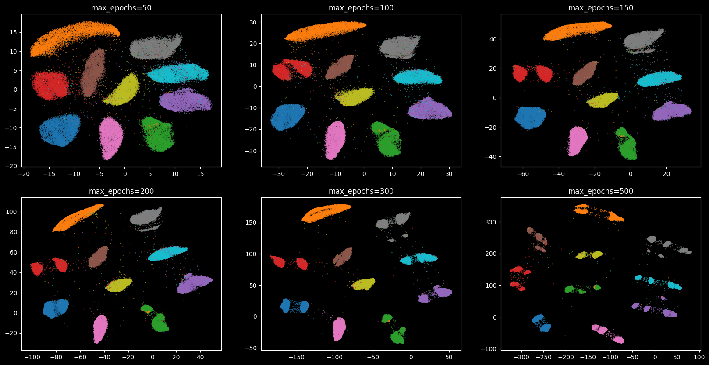
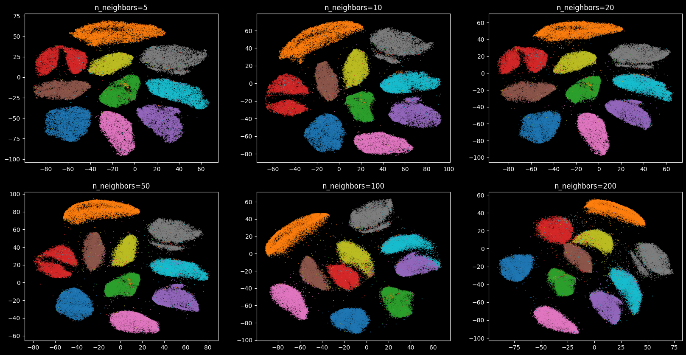
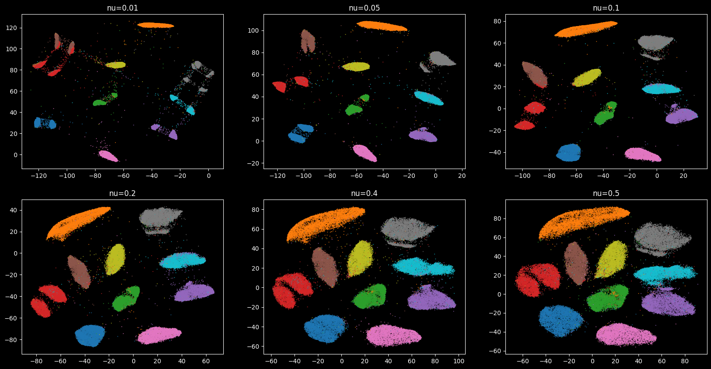

# DMT Parameters Documentation

DMT (Deep Manifold Transformation) is a deep learning-based dimension reduction method that preserves both global and local structures in data. The following parameters control the behavior and performance of DMT:
* `epoch`
* `n_neighbors`
* `nu`
  
## Table of Contents
- [DMT Parameters Documentation](#dmt-parameters-documentation)
  - [Table of Contents](#table-of-contents)
  - [max\_epochs](#max_epochs)
  - [n\_neighbors](#n_neighbors)
  - [nu](#nu)


Each of these parameters has a distinct effect, and we will look at each in turn. To make exploration simpler we will first write a short utility function that can fit the data with DMT given a set of parameter choices, and plot the result.

```python
import os
import torch
import numpy as np
import matplotlib.pyplot as plt
from dmt_learn import DMTLearn
from sklearn import datasets
from torchvision.datasets import MNIST
from torchvision import transforms
from tool.compair import compair, run_save_dmt
```

First, let's define our visualization utility function:

```python
def visualize_dmt_epochs(data, labels, param_name, param_values, random_state=0):
    """
    Trains DMT with different parameter values and visualizes the results.

    Parameters:
    - data: The input data to be reduced.
    - labels: Labels for coloring the scatter plot.
    - param_name: The name of the parameter to vary ('epoch', 'n_neighbors', 'nu').
    - param_values: List of values for the specified parameter.
    - random_state: Random seed for reproducibility.

    Returns:
    - vis_data_dict: Dictionary storing the reduced data for each parameter value.
    """
    vis_data_dict = {}
    fig, axes = plt.subplots(2, 3, figsize=(20, 10))
    axes = axes.flatten()

    for i, value in enumerate(param_values):
        dmt_params = {
            'random_state': random_state,
            'max_epochs': 100,
            'n_neighbors': 15,
            'nu': 0.1
        }
        dmt_params[param_name] = value
        
        dmt = DMTLearn(**dmt_params)
        vis_data = dmt.fit_transform(data)
        vis_data_dict[value] = vis_data

        ax = axes[i]
        scatter = ax.scatter(vis_data[:, 0], vis_data[:, 1], marker='.', c=labels, cmap='tab10', s=0.5)
        ax.set_title(f"{param_name}={value}")

    plt.show()
    return vis_data_dict
```

then, let's load and prepare the MNIST data:
```python
torch.set_float32_matmul_precision('medium')
transform = transforms.Compose([
        transforms.ToTensor(),
    ])
train_data = MNIST(root='data', train=True, download=True, transform=transform)

# 初始化空列表
data_list = []

# 遍历 train_data
for i in range(len(train_data)):
    # 获取第 i 个样本的特征数据，并转换为 NumPy 数组后压缩维度
    img_array = train_data[i][0].numpy().squeeze()
    data_list.append(img_array)

# 将列表转换为 NumPy 数组并重塑形状
DATA = np.stack(data_list).reshape((-1, 784))

# 提取标签
label_list = []
for i in range(len(train_data)):
    label_list.append(train_data[i][1])

LABEL = np.array(label_list)
```

## max_epochs
**Type:** Integer (default: 200)

The number of training iterations (epochs) for optimizing the DMT model. A higher number of epochs allows the model to learn more complex structures in the data but may lead to overfitting if set too high.

```python
# epochs : [50, 100, 150, 200, 300, 500]
vis_data_dict_epoch = visualize_dmt_epochs(DATA, LABEL, 'max_epochs', [50, 100, 150, 200, 300, 500], 0)
```



## n_neighbors
**Type:** Integer (default: 30)

Defines the number of nearest neighbors considered when constructing the local neighborhood graph. This parameter controls the balance between local and global structure preservation:


```python
# Visualize the effect of different n_neighbors values
# n_neighbors : [5, 10, 20, 50, 100, 200]
vis_data_dict = visualize_dmt_epochs(DATA, LABEL, 'n_neighbors', [5, 10, 20, 50, 100, 200], 0)

```



From the visualization, we can see how different values of n_neighbors influence the distribution of data in lower-dimensional space.   
The `n_neighbors` parameter significantly impacts how data is structured in lower-dimensional space. **Smaller values (5-10)** focus on preserving local structures, keeping clusters compact and detailed, but may result in a fragmented global view. **Medium values (15-30)** provide a balance between local and global structures, making them a solid choice for most cases. **Larger values (50-200)** emphasize global relationships, creating a smoother overall distribution but potentially blurring fine details and category boundaries. In general, lower values are better for capturing fine details, higher values are ideal for a more global perspective, and mid-range values offer the best trade-off.
## nu
**Type:** Float (default: 0.1) 

The parameter `nu` controls the degrees of freedom for the t-distribution in either latent space (nu_lat) or embedding space (nu_emb). It affects how heavy the tails of the distribution are, influencing how points are distributed in the visualization.

```python
# Example: Visualize the effect of different nu values
nu_values = [0.01, 0.05, 0.1, 0.2, 0.3, 0.5]
vis_data_dict = visualize_dmt_epochs(X, y, 'nu', nu_values)
```




From the result, we can conclude the following points.

**Lower values of nu (e.g., 0.01, 0.05, 0.1)** result in a t-distribution with heavier tails, allowing for more long-distance dependencies and leading to a less compact structure with scattered clusters and more noise. As nu increases to **moderate values (e.g., 0.2, 0.3)**, the visualization achieves a balance between local and global structures, where clusters become more defined while still preserving some long-range relationships. With **higher nu values (e.g., 0.4, 0.5)**, the t-distribution approaches a Gaussian, reducing the impact of outliers and making clusters more compact and well-separated, though long-distance relationships may be lost. From the image, we observe that increasing nu enhances separation and cluster clarity, whereas lower nu values lead to more scattered and less structured embeddings.

These parameters play a crucial role in tuning DMT for optimal performance in different applications. Users are encouraged to experiment with various settings and validate results based on their specific needs.